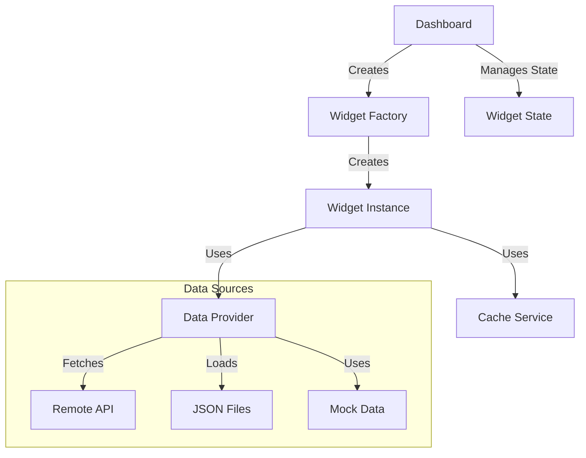
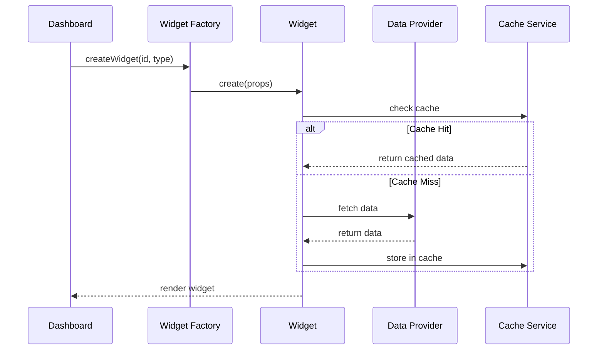

# Dashboard Widget Architecture POC

This project demonstrates a flexible and extensible dashboard architecture using React and TypeScript. It showcases several design patterns and architectural approaches for building modular, maintainable widget-based dashboards.

## Core Concepts

### Architecture Overview



### Widget Creation Flow



## Features

### Data-Driven Widgets
- Remote data fetching with caching
- Multiple data source support (APIs, JSON files)
- Automatic error handling
- Loading states
- Type-safe data handling

### Table Widget System
- Dynamic column configuration
- Automatic title adaptation
- Data caching

### Widget Factory
- Central registry of available widgets
- Type-safe widget creation
- Widget metadata management
- Automatic widget discovery in UI

### Dashboard Features
- Dynamic widget layout
- Add/remove widgets
- Widget state persistence
- Empty state handling
- Responsive grid system

## Architecture Benefits

1. **Extensibility**
   - New widgets can be added without modifying dashboard code
   - Support for different data sources
   - Pluggable caching mechanisms

2. **Maintainability**
   - Clear separation of concerns
   - Isolated widget logic
   - Centralized widget management

3. **Reusability**
   - Shared components and patterns
   - Abstract data handling
   - Common widget features

## Getting Started

1. Install dependencies:
```bash
npm install
```

2. Run Storybook:
```bash
npm run storybook
```

3. Build for production:
```bash
npm run build
```

## Development

### Adding a New Widget

1. Create widget component

```typescript
export const MyWidget: React.FC<MyWidgetProps> = ({ id, title, onRemove }) => {
  return (
    <Widget id={id} title={title} onRemove={onRemove}>
      {/* Widget content */}
    </Widget>
  );
};
```

2. Add to WidgetFactory

```typescript
export class WidgetFactory {
  private static readonly widgetTypes: WidgetTypeInfo[] = [
    {
      type: 'my-widget',
      label: 'My Widget',
      description: 'My Widget description'
    },
    //...
  ];

  createWidget(widgetId: string, type: WidgetInstance['type'], onRemove?: (id: string) => void): React.ReactElement {
    switch (type) {
      case 'my-widget':
        return <MyWidget key={widgetId} id={widgetId} onRemove={onRemove} />;
      //...
    }
  }
}
```

## Project Structure

```
src/
  components/
    Dashboard/      # Dashboard component and layout
    Widget/         # Widget components and base classes
  services/
    DataProvider.ts # Data fetching abstraction
    WidgetFactory.ts # Widget creation and management
  storybook/
    stories/        # Component stories
public/
  fixtures/         # JSON data files
```
