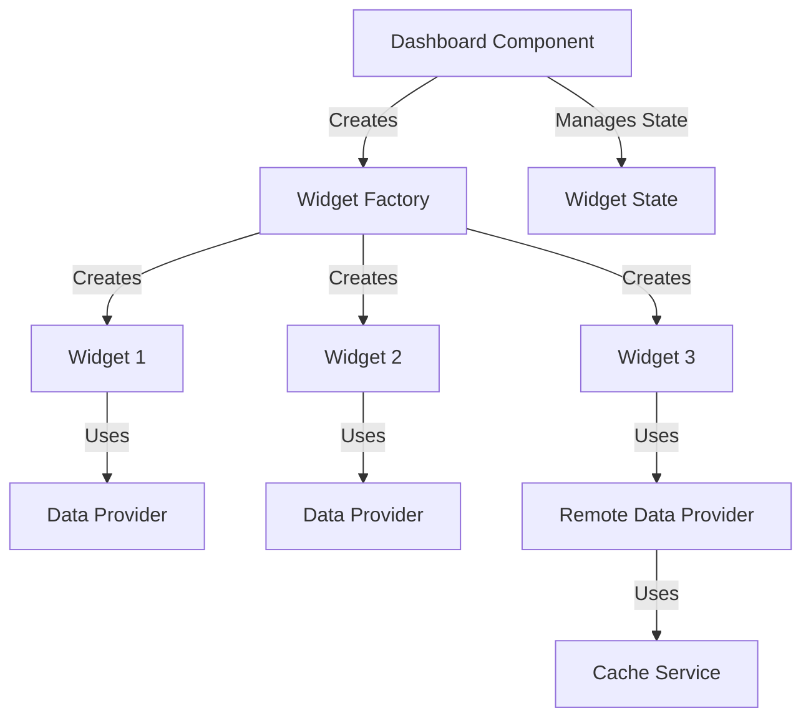
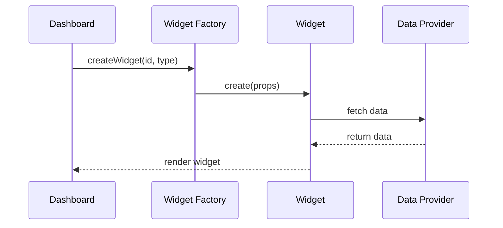

# Dashboard Widget Architecture POC

This project demonstrates a flexible and extensible dashboard architecture using React and TypeScript. It showcases several design patterns and architectural approaches for building modular, maintainable widget-based dashboards.

## Core Concepts

### Architecture Overview



### Widget Creation Flow



## Key Features

### 1. Decoupled Architecture
- Dashboard is unaware of specific widget implementations
- Widgets are self-contained and independently maintainable
- Widget Factory handles widget creation and configuration

### 2. Flexible Data Handling
- Abstract DataProvider interface
- RemoteDataProvider for external API calls
- Built-in caching mechanism for remote data
- Support for different data types (JSON, images, etc.)

### 3. Widget Management
- Dynamic widget addition/removal
- Centralized widget state management
- Shared widget controls (e.g., remove button)
- Automatic widget type discovery through factory

### 4. Component Patterns
- Higher-order components for shared functionality
- Render props for flexible content rendering
- Custom hooks for data fetching and state management

## Getting Started

### Prerequisites
- Node.js (v18 or higher)
- npm or yarn

### Installation
```bash
npm install
```

### Running Storybook
```bash
npm run storybook
```
This will start Storybook on http://localhost:6006

### Building Storybook
```bash
npm run build-storybook
```

## Widget Development

### Creating a New Widget

1. Create widget component:
```typescript
export const MyWidget: React.FC<WidgetProps> = ({ id, onRemove }) => {
  return (
    <Widget id={id} onRemove={onRemove}>
      {/* Widget content */}
    </Widget>
  );
};
```

2. Add to WidgetFactory:
```typescript
export class WidgetFactory {
  private static readonly widgetTypes = [
    {
      type: 'my-widget',
      label: 'My Widget',
      description: 'Description'
    },
    // ...
  ];

  createWidget(id: string, type: string) {
    switch (type) {
      case 'my-widget':
        return <MyWidget id={id} />;
      // ...
    }
  }
}
```

## Features in Detail

### Remote Data Handling
- Automatic caching of remote data
- Loading state management
- Error handling
- Configurable cache duration

### Widget Factory
- Central registry of available widgets
- Type-safe widget creation
- Widget metadata management
- Automatic widget discovery in UI

### Dashboard Features
- Dynamic widget layout
- Add/remove widgets
- Widget state persistence
- Empty state handling

## Architecture Benefits

1. **Extensibility**
   - New widgets can be added without modifying dashboard code
   - Support for different data sources
   - Pluggable caching mechanisms

2. **Maintainability**
   - Clear separation of concerns
   - Isolated widget logic
   - Centralized widget management

3. **Reusability**
   - Shared components and patterns
   - Abstract data handling
   - Common widget features

4. **Type Safety**
   - Full TypeScript support
   - Type-safe widget creation
   - Compile-time error checking

## Contributing

1. Create a new branch
2. Add your changes
3. Add appropriate stories to Storybook
4. Submit a pull request

## License

MIT
